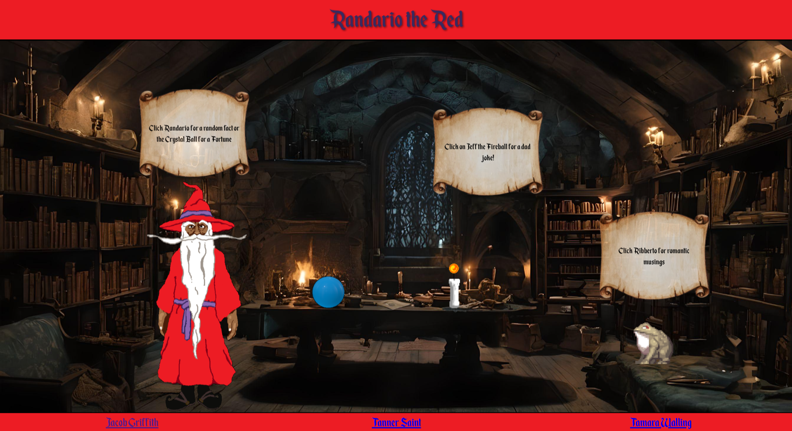

# Randario the Red

Welcome to **Randario the Red**—a whimsical web application where magic meets interactivity! 🌟

### What is Randario the Red?

Randario the Red is an enchanting experience designed to bring a smile to your face and a sprinkle of magic to your day. Dive into a world where you can:

- **Consult the Wizard** 🧙‍♂️: Interact with a charming wizard who will share fascinating random facts to amuse and amaze you.
- **Peer into the Crystal Ball** 🔮: Discover your destiny with fortunes from our mystical crystal ball.
- **Laugh with the candle and flame of Dad Jokes** 🕯️🔥: Enjoy a hearty laugh with the best dad jokes—perfect for lightening the mood.
- **See the Love Struck Frog** 🐸: Get quirky and heartfelt love quotes from our wise frog friend.

### How It Works

Access Randario the Red with GitHub pages!
<https://jacobgriffith1.github.io/Randario_the_Red/>

**OR**

- In Visual Studio Code, install the "Live Server" extension. 
- Right click 'index.html' and 'Open with Live Server'; or with 'index.html' open, use [Alt+L] , [Alt+O]

Interact with the various elements on our page to receive:

- **Random Facts**: Click on Randario, for the Fascinating tidbits of knowledge from our wizard.
- **Fortunes**: Click on Frankie Fortuna, for Predictions and insights from the crystal ball.
- **Dad Jokes**: Click on the Jeff, for absolute heaters served up by the candle and flame.
- **Love Advice**: Click on Ribberto, for Passion and love quotes from the frog looking for his princess.

### Get Involved

Feel the magic, share the laughter, and be enchanted. Explore each feature, and let Randario the Red add a touch of wonder to your day!

Happy enchanting! ✨

<https://youtu.be/1HbsB71buWw>

- Jacob Griffith <https://github.com/JacobGriffith1>
- Tanner Saint <https://github.com/TrippyVaultBoy>
- Tamara Walling <https://github.com/Scoob1>

### Additional Details

Randario the Red was the first big independently led project undertaken by Tanner, Tamara, and Me during our education at Atlas School. I have opted to leave the code as it is, only modifying comments within as a sort of benchmark of what our skills looked like after just a few months of coding experience. Our growth has been exponential since then and I hope you enjoy seeing our humble beginnings.

Please enjoy Randario the Red and look forward to future enchanting projects!
-JG